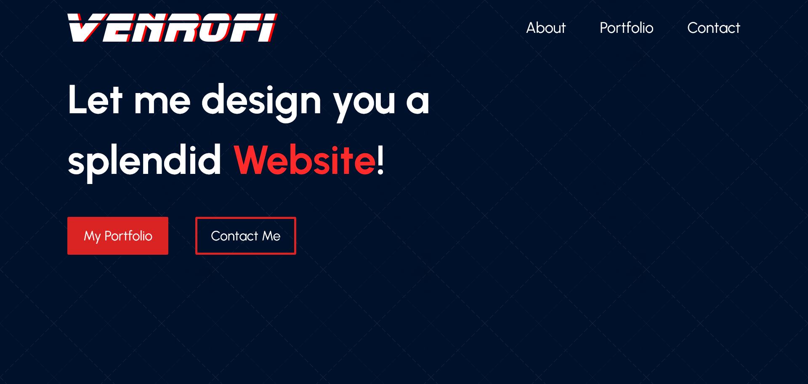

# My Portfolio Website created with React

## Table of contents

- [Overview](#overview)
  - [Screenshot](#screenshot)
  - [Links](#links)
- [My process](#my-process)
  - [Built with](#built-with)
  - [What I learned](#what-i-learned)
- [Author](#author)

### Screenshot

### Links

- Live Site URL: [VENROFI](https://venrofi.netlify.app/)

### Built with

- Semantic HTML5 markup
- SASS
- Flexbox
- JavaScript
- React

## Author

- LinkedIn - [@Venrofi](https://www.linkedin.com/in/radoslaw-terelak/)
- Twitter - [@RadekTerelak](https://twitter.com/RadekTerelak)
